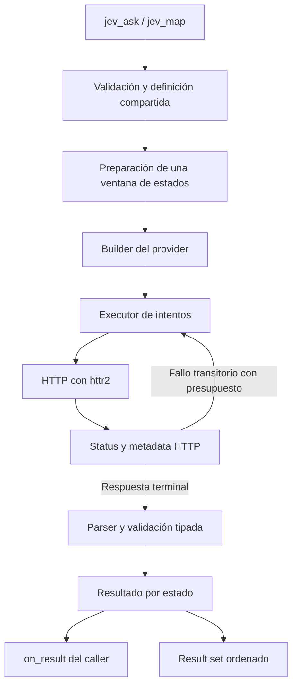

# jevr: revisión arquitectónica y plan de desarrollo

**Fecha:** 19 de septiembre de 2026. **Estado:** propuesta para revisión; no implementada.

**Base examinada:** jevr 0.1.0, commit [`3db78fbea95712589e760eb65c774ac6e1aedcdf`](https://github.com/simxnherrera/jevr/tree/3db78fbea95712589e760eb65c774ac6e1aedcdf). Se leyeron todos los archivos de `R/`, los tests, DESCRIPTION, README y la configuración de CI, además de la [issue #1](https://github.com/simxnherrera/jevr/issues/1), abierta y sin comentarios al consultar. También se contrastaron documentación y código oficial de los proveedores y httr2.

**Alcance de la evidencia:** revisión estática. No se modificó el repositorio, no se hicieron solicitudes de inferencia pagas y no se ejecutaron benchmarks. Este entorno no tiene R disponible; los tests existentes fueron inspeccionados, no ejecutados. Las cifras de rendimiento que aparecen como ejemplos de cálculo no son mediciones de jevr. Todos los ejemplos con nuevas funciones describen la API propuesta.

## 1. Executive recommendation

**Elegiría un cliente de decisiones con ejecución múltiple acotada, resultados auditables y persistencia externa.** La evolución principal consiste en compartir validación, serialización y parsing entre `jev_ask()` y `jev_map()`, y agregar un executor pequeño que controle los intentos y conserve la correspondencia entre entradas y resultados.

La API cotidiana debería ser:

```r
questions <- list(supported = jev_noul("Does the evidence support the claim?"))
one <- jev_ask(state, questions)
many <- jev_map(states, questions)
```

Para decisiones que se mantienen y comparan históricamente:

```r
spec <- jev_spec(
  name = "claim_validation",
  version = "1.0.0",
  questions = questions
)
many <- jev_map(states, spec, model = "jev-1.13.0")
```

### Decisiones principales

| Decisión | Recomendación |
|---|---|
| Unidad semántica | Un `state` completo y un conjunto de preguntas independientes. |
| API múltiple | `jev_map(states, questions)`; aceptar también una spec en `questions`. |
| Vectorización de `jev_ask()` | No. Una lista o array ya puede ser un solo estado. |
| Spec | Sí, opcional, como manifiesto S3 de datos. Sin ejecución, templates, funciones ni registro global. |
| HTTP concurrente | Priorizar httr2, con pruebas previas de límites, retries y cancelación. |
| Ownership de retries | Un solo controlador en jevr; no superponer retries de varias capas. |
| Concurrencia inicial | Entero fijo, default provisional 4; configurable. No presentar 4 u 8 como óptimo demostrado. |
| Rate limiting | Control separado de la concurrencia; throttle preventivo más pausas compartidas ante 429/529. |
| Preguntas compartiendo estado | Una request cuando quepan y no haya dependencia real entre respuestas. |
| Registros compartiendo estado | Experimental; sin `batch_size` público estable. |
| Resultados | Lista S3 por estado, respuestas completas, conversión long a data.frame y tabla de requests separada. |
| Persistencia | Identidad estable, resultados serializables y entrega incremental; almacenamiento y reanudación durable externos. |
| Planner | Preparación interna por ventana; no objeto público ni plan global de millones de requests. |
| mirai | Opción C: fuera del paquete; composición por el caller. |

**No haría ahora:** `concurrency = "auto"`, cache en disco administrada por jevr, jobs persistentes, conectores DBI/Arrow, un framework de providers, múltiples backends de paralelización ni traducción automática de preguntas para agrupar registros.

El hallazgo técnico más importante es que `req_perform_parallel()` no equivale a “el transporte actual, pero concurrente”: su documentación advierte que ignora `max_tries` y que no activa el circuit breaker. Esto obliga a probar un adaptador con intentos individuales controlados por jevr, antes de aprobarlo como backend. [Documentación de httr2](https://httr2.r-lib.org/reference/req_perform_parallel.html).

## 2. Current architecture

### 2.1 Flujo real

1. `jev_choice()`, `jev_score()` y `jev_noul()` construyen listas S3 con `type`, `instructions` y `criteria`.
2. `jev_ask()` valida provider, estado, lista de preguntas, timeout, retries y modelo.
3. Un `switch()` selecciona `jev_request_typesafe()` o `jev_request_openrouter()`.
4. Cada provider lee la credencial, crea el payload y construye la request.
5. `jev_build_request()` configura headers, JSON con `auto_unbox = TRUE`, `null = "null"` y timeout.
6. `jev_send_request()` llama sincrónicamente a `httr2::req_perform()`, clasifica status y hace backoff con `Sys.sleep()`.
7. El provider decodifica JSON y devuelve `list(body, response)`.
8. `jev_ask()` entrega solamente `body` al parser. El objeto HTTP se descarta.
9. `jev_parse_response()` devuelve `jev_response`, con respuestas tipadas, usage, metadata y body original en `raw`.

Esto ya representa correctamente el caso de un estado y varias preguntas. No hay que reconstruir esa abstracción. [Código de ask](https://github.com/simxnherrera/jevr/blob/3db78fbea95712589e760eb65c774ac6e1aedcdf/R/ask.R), [transporte](https://github.com/simxnherrera/jevr/blob/3db78fbea95712589e760eb65c774ac6e1aedcdf/R/transport.R).

### 2.2 Qué conservar y qué separar

| Archivo | Activo reutilizable | Cambio necesario |
|---|---|---|
| `R/ask.R` | Firma, validaciones comunes, correspondencia por question ID | Extraer preparación reutilizable; admitir spec sin alterar el argumento `questions`. |
| `R/questions.R` | Constructores y clases pequeñas | Validación recursiva; volver a validar objetos modificados después de construirlos. |
| `R/state.R` | Distinción conceptual entre objeto y array | Contrato explícito de serialización, tipos y errores con ruta al campo. |
| `R/provider-typesafe.R` | Endpoint y transformación casi directa | Devolver request sin enviarla; extraer metadata HTTP al recibir. |
| `R/provider-openrouter.R` | Endpoint y headers de atribución | Separar traducción de envío y actualizar capacidades contrastadas con SDK. |
| `R/transport.R` | Status transitorios, Retry-After, backoff y seams para mocks | Separar un intento de su política de repetición; registrar cada intento. |
| `R/response.R` | S3 por tipo; conservación de campos extra y raw | Validar contra preguntas completas; conservar legend estructurada y distinguir fallos de respuesta. |
| `R/errors.R` | Condiciones propias | Añadir campos estructurados homogéneos y distinguir fallo individual de fallo global. |
| `DESCRIPTION` | Sólo httr2 en Imports | Fijar versión mínima verificada; declarar directamente JSON/hash si se usan. |
| Tests | Mocks, snapshots, pruebas pagas opt-in | Extender contrato de serialización, asociación, scheduler y recovery. |

### 2.3 Problemas concretos, por prioridad

**P0: el parser no comprueba toda la decisión contra la pregunta.** Recibe tipos, no definiciones. Un Choice puede aceptar una etiqueta que no exista en `criteria`; no verifica igualdad de claves, duplicados o suma de probabilidades. Score exige un número finito, pero no comprueba rango respecto de la rúbrica ni correspondencia entre niveles y probabilidades. No corresponde recalcular silenciosamente respuestas inválidas: hay que detectarlas. Un test de OpenRouter incluso usa sólo `technical = 1` como distribución para una pregunta con dos opciones; debe dejar de ser fixture de éxito completo cuando se refuerce ese contrato.

**P0: validación JSON superficial.** Las listas se aceptan sin recorrer sus elementos. Puede pasar validación un estado con funciones, NA o nombres ambiguos anidados; el fallo aparece más tarde en serialización. La clase `jev_question` tampoco garantiza que el usuario no haya alterado el objeto. Es necesario validar los datos efectivos que se enviarán, una vez por definición compartida y una vez por estado.

**P1: asimetría entre preguntas y respuestas estructuradas.** jevr admite niveles Score estructurados, pero el parser obliga a que `legend` sea un vector de strings. El SDK oficial de TypeSafe modela legend con strings, objetos o arrays. Por tanto, una capacidad aceptada en la entrada puede ser rechazada a la salida. Hay que conservar el vector actual cuando todos los niveles son strings y admitir lista cuando no lo sean. [Parser actual](https://github.com/simxnherrera/jevr/blob/3db78fbea95712589e760eb65c774ac6e1aedcdf/R/response.R), [tipos oficiales de respuesta](https://github.com/typesafe-ai/typesafe-sdk-python/blob/2ce5c65f13646cab6e6f782328194c9d85f3300a/src/typesafe_sdk/_core/response_types.py).

**P1: adaptación de OpenRouter desactualizada frente al SDK consultado.** `jev_openrouter_text()` rechaza estructura y convierte NULL a string vacío. El SDK oficial actual admite objetos y arrays en instrucciones y criterios, y NULL para descripciones Choice. No hay que mantener una restricción antigua ni convertir NULL a `""` como si fueran idénticos. El esquema actual no permite todos los mismos NULL que TypeSafe: preservar diferencias por campo, no una bandera global “structured = TRUE”. Falta validar el endpoint vivo mediante integración opt-in antes de prometer equivalencia absoluta. [Choice en el SDK de OpenRouter](https://github.com/OpenRouterTeam/typescript-sdk/blob/eb9ab9905c5d84beb523cf70b0b838f3743215f3/src/models/decisionschoicequestion.ts), [Noul](https://github.com/OpenRouterTeam/typescript-sdk/blob/eb9ab9905c5d84beb523cf70b0b838f3743215f3/src/models/decisionsnoulquestion.ts).

**P1: metadatos descartados.** En éxitos no salen attempts, timings, headers ni identificador HTTP de TypeSafe. `jev_http_error()` menciona attempts en el mensaje, pero no lo guarda como campo, mientras el error de transporte sí lo hace. El resumen no debería tener que parsear mensajes para contar intentos.

**P1: retry demasiado amplio para errores R.** `tryCatch(..., error = identity)` trata cualquier error de `perform()` como problema de conexión. Un error de programación o de configuración no debe repetirse como si fuera transitorio. Restringir a condiciones de transporte conocidas y propagar fallos internos.

**P1: retries acotados en cantidad, no en tiempo total.** Hoy hay timeout por intento y máximo de repeticiones, pero un Retry-After muy grande puede bloquear durante mucho tiempo. Falta presupuesto temporal y jitter. Esto es diferente de afirmar que hoy haya retries infinitos: el bucle propio sí limita intentos.

**P2: validación de usage y compatibilidad.** Se verifica que los contadores sean numéricos escalares, pero no no-negativos, finitos y no ausentes. Además, el SDK de TypeSafe admite contadores desconocidos. La decisión puede ser válida aunque el proveedor omita metadatos: diferenciar “respuesta de decisión inválida” de “usage incompleto”, y representar desconocidos con NA.

### 2.4 Tests actuales

La suite prueba constructores, preguntas compartidas, endpoints, metadata básica, JSON inválido, algunos inputs incorrectos, retry 429 con Retry-After cero, límite de intentos con 529 y recuperación tras un error simulado de conexión. Incluye integración paga opt-in y CI para Windows, macOS y varias versiones de R en Linux.

No cubre serialización recursiva ni bytes efectivos, HTTP-date en Retry-After, headers en resultados, estructura de legend, todas las validaciones de probabilidades, concurrencia, interrupciones, IDs masivos ni persistencia. Los tests que inspeccionan `request$body$data` verifican el objeto anterior a serialización; no sustituyen pruebas del JSON enviado. [Tests examinados](https://github.com/simxnherrera/jevr/tree/3db78fbea95712589e760eb65c774ac6e1aedcdf/tests/testthat).

## 3. JEV semantics

### 3.1 Hechos verificados y consecuencias

| Aspecto | Evidencia oficial consultada | Consecuencia para jevr |
|---|---|---|
| State | String, objeto o array; todo ello es un estado. | El contenedor de `jev_ask()` no determina cuántas requests hacer. |
| Preguntas | Comparten estado y se evalúan por separado; sus IDs identifican respuestas y no son instrucciones al modelo. | Conservar IDs; incluir el sentido completo en instructions. |
| Dependencias | Una respuesta no alimenta otra pregunta dentro de la misma request. | Una etapa dependiente necesita otra llamada del caller. |
| Parallel questions | Se recomienda enviar juntas las preguntas aplicables al mismo estado. | No dividir el conjunto por comodidad del cliente. |
| Fan-out especulativo | Se pueden preguntar ramas que después el código descarte. | No necesita nueva función; basta una lista de preguntas. |

Fuentes: [State](https://docs.typesafe.ai/concepts/state), [Primitives](https://docs.typesafe.ai/primitives), [Speculative fan-out](https://docs.typesafe.ai/patterns/fan-out).

Para Jev 1.13 la página Models publica **1.200 requests/minuto y 250.000 tokens/segundo**, sujetos a cambios dinámicos y planes. Publica **64k tokens por request**, con una segunda restricción de **32k para state más la pregunta más larga**. `jev-latest` apunta actualmente a `jev-1.13.0`, pero puede cambiar. Esto no autoriza a inferir “miles de requests simultáneas por cuenta”. Tampoco prueba que OpenRouter comparta los mismos límites. [Models](https://docs.typesafe.ai/models).

Hay una discrepancia documental: Primitives menciona aproximadamente 32k como presupuesto general; Models distingue los dos límites anteriores. La implementación debe modelar ambos y fechar las capacidades, sin fingir disponer de un tokenizer exacto. Un conteo de caracteres no certifica que una request quepa.

### 3.2 Qué significa la independencia

La garantía documentada se refiere a cambiar el conjunto de preguntas manteniendo el estado. No garantiza que añadir otros documentos al estado deje intacta una decisión. Esa distinción es suficiente para rechazar record batching automático como transformación semánticamente neutra.

El cookbook de parallel questions compara 13 preguntas juntas con 13 llamadas sobre el mismo documento, con cinco repeticiones. Reporta 12,2 veces menos costo y 10 veces menos tiempo frente a ejecución secuencial; reconoce variación en algunas respuestas. No es una prueba de millones de estados, ni de escalado lineal con concurrencia, ni de equivalencia entre estados distintos. [Cookbook oficial](https://docs.typesafe.ai/cookbooks/parallel_questions).

Hay evidencia oficial de múltiples elementos dentro de un estado: el ejemplo de “counting” crea preguntas que apuntan explícitamente a `items[i]`. Eso demuestra que el patrón se puede expresar. La misma página advierte que contexto irrelevante y contenido adversarial pueden mover respuestas. No aporta una garantía de aislamiento entre esos elementos. [Limitaciones y ejemplo de Jev 1.13](https://docs.typesafe.ai/model-jaggedness/jev-1.13).

### 3.3 Tipos, confianza y metadata

Choice conserva etiqueta y distribución; Score conserva valor continuo, distribución y legend; Noul conserva el valor 0–1. `confidence` resume la distribución en Choice y Score. No es una segunda probabilidad independiente, ni hay confidence separado en Noul. No convertir Noul a booleano ni reemplazar Score por un nivel entero. [Confidence](https://docs.typesafe.ai/confidence), [API](https://docs.typesafe.ai/api).

Los thresholds y las decisiones posteriores pertenecen al sistema de aplicación. Cambiar un threshold no requiere volver a preguntar al modelo si las probabilidades originales están disponibles.

### 3.4 Retries y SDK async

TypeSafe documenta 429 por rate limiting y 529 por sobrecarga, con backoff. Su SDK Python ofrece clientes sync y async; el código consultado usa `httpx2.AsyncClient` y `AsyncRetrying` de Tenacity. RetryPolicy tiene límites de intentos y tiempo, jitter y soporte de Retry-After en segundos/fecha y `retry-after-ms`. Esto avala transporte async con política de fallos; no promete concurrencia ilimitada ni ejecuta automáticamente un corpus por usar `await`. [SDK Python](https://docs.typesafe.ai/sdk/python), [RetryPolicy](https://docs.typesafe.ai/sdk/python/api/retries), [implementación](https://github.com/typesafe-ai/typesafe-sdk-python/blob/2ce5c65f13646cab6e6f782328194c9d85f3300a/src/typesafe_sdk/_core/retry.py).

### 3.5 OpenRouter: confirmado y pendiente

El SDK oficial inspeccionado identifica `POST /api/alpha/decisions`, estado string/objeto/array, preguntas Choice/Score/Noul, preferencias de provider y metadata de observabilidad opcionales. La respuesta modela `model`, `answers`, usage y opcionalmente `id`, `provider` y costo. Se conserva el estado estructurado; no hay razón para convertirlo siempre a texto. [Request](https://github.com/OpenRouterTeam/typescript-sdk/blob/eb9ab9905c5d84beb523cf70b0b838f3743215f3/src/models/decisionsrequest.ts), [endpoint](https://github.com/OpenRouterTeam/typescript-sdk/blob/eb9ab9905c5d84beb523cf70b0b838f3743215f3/src/funcs/alphaDecisionsCreate.ts), [response](https://github.com/OpenRouterTeam/typescript-sdk/blob/eb9ab9905c5d84beb523cf70b0b838f3743215f3/src/models/decisionsresponse.ts).

No pude recuperar una página verificable de **Jev Labs con el ejemplo tabular concreto** mencionado en el encargo. La página de Labs y las rutas de referencia web intentadas no entregaron contenido útil; por eso contrasté el SDK oficial. No atribuyo a OpenRouter garantías de aislamiento, equivalencia, número máximo de preguntas o throughput que no pude verificar. El ejemplo de TypeSafe anterior sí permite evaluar técnicamente el patrón, sin depender de esa atribución pendiente.

## 4. Proposed public API

### 4.1 Superficie mínima

Mantener las cuatro funciones existentes. Agregar dos en la evolución principal: `jev_map()` y `jev_spec()`. No agregar `jev_batch()`, `jev_async()`, `jev_parallel()`, `failures()` ni `jev_resume()`.

Firma propuesta para map:

```r
jev_map(
  states,
  questions,
  provider = c("typesafe", "openrouter"),
  model = NULL,
  concurrency = 4L,
  timeout = 30,
  max_retries = 3L,
  rate_limit = 5,
  retry_budget = 120,
  on_result = NULL,
  progress = interactive()
)
```

Los defaults de concurrencia y requests/segundo son **propuestas prudentes del cliente**, sujetas a benchmark, no límites oficiales. `rate_limit` permite subir/bajar la tasa según cuenta y workload; `concurrency` limita cuántas requests pueden estar activas. El uso habitual no necesita especificarlos. `retry_budget` incluye intentos y esperas de un ítem una vez admitido, no el tiempo que todos los ítems pasan esperando en la cola inicial.

Los argumentos avanzados no justifican todavía un objeto público `jev_control()`. Tampoco usaría `...` para ocultar opciones no validadas. `jev_ask()` conserva su firma actual; posibles opciones nuevas se agregan al final o como keyword-only mediante una evolución documentada, sin cambiar el significado de `timeout` o `max_retries`.

### 4.2 Contrato de entrada

| Input de `jev_map()` | Interpretación |
|---|---|
| Vector character | Un string por estado. |
| Lista | Cada elemento es un estado completo, que puede contener otras listas. |
| Lista vacía / character vacío | Result set vacío; cero HTTP. |
| Nombres | IDs de negocio si son completos, no vacíos y únicos. |
| Sin nombres | IDs posicionales locales; no se presentan como IDs durables. |
| Nombres duplicados, parciales o NA | Error global antes de enviar. |
| data.frame directo | Rechazar con explicación y ejemplo de conversión explícita a lista de filas. |
| Fórmula, función, iterator | No admitidos en v1. |

Un data.frame es una lista de columnas en R. Aceptarlo sin convención explícita añade otra ambigüedad; es preferible `jev_map(setNames(df$texto, df$id), questions)` o una lista de registros construida por el caller. No se requiere dependencia de dplyr o purrr.

```r
# Dos registros independientes: dos evaluaciones.
states <- list(
  doc_001 = list(text = "...", claim = "...", evidence = "..."),
  doc_002 = list(text = "...", claim = "...", evidence = "...")
)
results <- jev_map(states, questions)

# Un único estado que incluye ambos registros: una evaluación compartida.
one <- jev_ask(states, questions)
```

### 4.3 Spec: justificación y límites

La spec resuelve un problema real de medición: conservar qué significaba una decisión cuando se produjo. Una lista de preguntas alcanza para ejecutar, pero no establece por sí sola un contrato común de nombre, versión, hash y serialización histórica.

```r
spec <- jev_spec(
  name = "relation_validation",
  version = "1.2.0",
  questions = list(
    relation = jev_choice(
      "How does `evidence` relate to `claim`?",
      c(
        supports = "Evidence explicitly supports the claim",
        contradicts = "Evidence explicitly contradicts the claim",
        insufficient = "Evidence does not establish either conclusion"
      )
    ),
    supported = jev_noul("Is `claim` explicitly supported by `evidence`?"),
    current = jev_noul("Does `evidence` describe the relation as currently holding?")
  )
)

one <- jev_ask(states[[1]], spec, model = "jev-1.13.0")
many <- jev_map(states, spec, model = "jev-1.13.0")
```

Las dos primeras preguntas pueden ser redundantes, pero también operacionalizaciones deliberadamente diferentes; jevr no debe deduplicarlas ni imponer identidades numéricas entre respuestas. La vigencia cronológica calculable por fechas se resuelve fuera del modelo; el ejemplo pregunta por cómo la fuente presenta la relación.

**Representación:** lista S3 con `schema_version`, `name`, `version`, `questions` y hash recalculable. El hash se deriva de los cuatro primeros campos; nunca se incluye a sí mismo. Sólo datos JSON representables. Sin closures, conexiones, credenciales, provider ni modelo. Se puede usar con ambos providers cuando las capacidades lo permitan. Guardar el manifiesto completo, no sólo el hash.

**Versionado:** `version` es una etiqueta explícita del autor; recomendar SemVer sin pretender deducir qué cambio conceptual es mayor. El hash detecta cambios incluso si alguien olvidó aumentar la versión. Un nombre y versión con hashes distintos debe detectarlo el registro externo; jevr no mantiene una base global para impedirlo.

**Mutabilidad:** R no garantiza inmutabilidad de listas. Revalidar y recalcular al preparar la ejecución; no confiar en un hash almacenado que pueda haber quedado desactualizado. **Serialización:** RDS sirve para recuperación en R; el manifiesto JSON versionado permite archivo interoperable. No crear un lenguaje YAML ni un framework de importación. Se pueden añadir métodos de exportación sólo si los ejemplos reales los requieren.

Una lista común sigue siendo válida: se calcula identidad de su definición, con nombre y versión ausentes. La spec es recomendable para producción histórica, no un requisito para aprovechar concurrencia.

## 5. Internal architecture

### 5.1 Capas pequeñas, no framework



| Componente | Responsabilidad | Qué no hace |
|---|---|---|
| API | Defaults, shape de inputs, compatibilidad, mensajes | No envía HTTP directamente. |
| Preparación | Definición compartida, IDs, validación, serialización y tamaño de la ventana | No carga SQL ni consume toda una fuente remota. |
| Builder | Traducir contenido al contrato del provider y construir request | No hace retries ni parsea respuestas. |
| Executor | Intentos, elegibilidad temporal, throttle, límites y entrega de terminales | No interpreta Choice ni decide thresholds. |
| Adaptador de respuesta | Status, headers permitidos, campos específicos del provider | No completa con valores inventados. |
| Parser | Validar respuestas contra preguntas; producir objetos tipados | No reenvía requests ni corrige outputs del modelo. |

Las capas pueden ser funciones en cinco o seis archivos; no requieren seis clases ni interfaces abstractas.

### 5.2 Planner: no por ahora

V1 necesita un contexto compartido y una tabla interna de ítems de la ventana: índice, ID, estado de ejecución, tamaño en bytes, intentos y próxima elegibilidad. Eso no es un optimizador ni un execution plan público.

Cantidad de states, provider, modelo y preguntas se conocen antes de empezar. Tamaños se calculan al serializar la ventana. No conocemos tokens exactos, cache hits externos o tiempos futuros. No construir primero todas las requests: duplicaría memoria y pospondría trabajo útil.

Un planner explícito aportaría valor si en el futuro coexisten particiones de preguntas, reutilización parcial por pregunta, límites exactos de tokens y agrupación experimental. Hasta entonces, llamarlo planner sugeriría capacidades que no existen. Un `dry_run` que requiera enviar inferencia tampoco sería un dry run.

### 5.3 Contrato interno de provider

Usar un `switch()` que devuelva una pequeña lista de funciones/capacidades internas es suficiente:

```r
# Esquema conceptual interno, no API pública.
list(
  name = "typesafe",
  contract_version = 1L,
  default_model = "jev-latest",
  validate = validate_provider_input,
  encode = encode_provider_payload,
  build = build_provider_request,
  metadata = extract_provider_metadata
)
```

`encode()` recibe contenido ya validado y devuelve el payload efectivo sin credenciales. `build()` añade endpoint, autenticación, timeout y throttle. `metadata()` conserva modelo recibido, ID de respuesta, request ID de header, usage y campos extra. El parser tipado puede ser compartido mientras los esquemas lo permitan; las traducciones futuras quedan en el adaptador.

Las capacidades describen formas por campo y metadatos conocidos, no prometen que los proveedores sean semánticamente equivalentes. Separar `provider` de `upstream_provider`. No hacer fallback automático entre proveedores: cambia ruta, potencialmente condiciones de datos, costo e identidad. No exponer registro de plugins por sólo dos implementaciones.

### 5.4 Presupuesto de abstracciones

| Abstracción | Problema propio de jevr | Por qué no basta otra capa | Mantenimiento |
|---|---|---|---|
| `jev_map()` | Ejecutar decisiones y asociar cada fallo/output a un estado | purrr mapea; no define retries, metadata ni contrato JEV común | Medio; justificado. |
| `jev_spec()` | Versionar definiciones de decisiones | Base R almacena listas, pero no el contrato compartido del paquete | Bajo si sólo datos. |
| Executor acotado | No exceder intentos ni perder correspondencia | httr2 mueve HTTP; sus retries paralelos no satisfacen el contrato actual | Medio; contenerlo. |
| Result set S3 | Mezclar éxitos/fallos y conservar tipos/procedencia | data.frame plano obliga a coerción o duplicación de usage | Medio-bajo. |
| Identidad versionada | Reutilizar decisiones sin confundir definiciones | targets identifica su grafo; no define identidad interoperable de JEV | Medio; requiere contrato estable. |
| `on_result` | Entrega incremental a la persistencia elegida | DBI no recibe resultados hasta que alguien se los entrega | Bajo, con semántica explícita. |
| Planner público/cache/jobs | Ninguna necesidad inmediata que exija estas capas | Caller, targets y almacenamiento resuelven gran parte | Alto; descartados. |

## 6. Concurrency and batching strategy

### 6.1 Tres operaciones diferentes

| Operación | State | Questions | HTTP | Decisión |
|---|---|---|---|---|
| A. Parallel questions | El mismo | Varias independientes | Una request | Estable; ya existe. |
| B. Concurrent requests | Distintos | Mismo conjunto, por estado | Varias en vuelo | Implementar mediante `jev_map()`. |
| C. Multi-record batching | Un contenedor nuevo con varios registros | Preguntas dirigidas a cada registro | Menos requests, más grandes | Experimental; no transformación silenciosa. |

Una ventana de scheduling con 4 requests **no** es un state batch de 4 registros. Un chunk de 500 registros que el caller persiste tampoco lo es.

### 6.2 Backend recomendado y primera implementación

Preferir `httr2::req_perform_parallel()` porque ya se usa httr2 y puede multiplexar HTTP sin sesiones R adicionales. No significa que la función R sea no bloqueante para Shiny: el caller espera el retorno de `jev_map()`.

**Diseño inicial implementable:** ejecutar ondas de como máximo `concurrency` requests, con un intento HTTP por ítem en cada invocación del backend. Configurar `req_error(is_error = function(resp) FALSE)` para devolver status HTTP y clasificarlo después; desactivar explícitamente clasificación/repetición transitoria interna y retry de fallos de transporte. No confiar sólo en `max_tries = 1`. Usar `on_error = "continue"` para condiciones HTTP/transport soportadas y dejar errores de programación fuera del retry. [Control público de errores httr2](https://httr2.r-lib.org/reference/req_error.html).

Al terminar una onda, jevr procesa respuestas, registra intentos y programa sólo fallos elegibles. Cada request debe haber tenido exactamente un intento de red según el servidor de prueba. Las credenciales son Bearer; no hay un flujo OAuth que deba refrescar tokens en este camino.

Este enfoque permite contar intentos exactamente y reaccionar a señales antes de admitir la siguiente onda. Tiene un costo: cada onda espera a su request más lenta y puede reducir reuse de conexiones entre invocaciones, que habrá que medir. Es una concesión deliberada inicial, no una afirmación de rendimiento máximo. Priorizar una cola rolling sólo si esa pérdida resulta material.

No construir una enorme cola httr2 con 500.000 requests. Además del consumo de memoria, con retries externos jevr sólo observaría errores al finalizar toda esa llamada y reaccionaría demasiado tarde. Ondas pequeñas acotan tanto memoria del transporte como el exceso de requests posterior a un fallo global.

### 6.3 Condiciones de aceptación del backend

Antes de publicar map deben probarse: intentos únicos, máximo efectivo en vuelo, asociación bajo completado desordenado, pausas, timeouts y cancelación. El código upstream inspeccionado también captura la primera interrupción y puede devolver respuestas parciales tras drenar requests activas; no se puede asumir que una interrupción escape siempre al wrapper. [Implementación de httr2](https://github.com/r-lib/httr2/blob/main/R/req-perform-parallel.R).

Si el backend devuelve NULL para pendientes, jevr debe detenerse y conservarlos, nunca interpretarlos como éxito. Hay además un caso que requiere prueba específica: interrupción cuando toda una onda ya está activa y termina drenándose completa. El wrapper necesita saber que no debe iniciar la siguiente onda. **Si la API pública de la versión probada no permite distinguirlo robustamente, resolver con upstream o usar un adaptador curl multi mínimo para este requisito. No depender de R6 privados ni de reconocer un warning por su texto.** Esta es una condición de viabilidad concreta, no una tarea posterior al lanzamiento.

### 6.4 Concurrencia fija versus auto

Una configuración fija con buenas pausas ya permite `jev_map(states, spec)`. La simplicidad del uso no exige un controlador adaptativo.

V1: default 4, techo entero explícito, rate limit independiente, cooldown compartido. No usar número de CPU como heurística para HTTP. No adoptar 8 sólo porque figura en la issue; contrastar 4 y 8 antes de fijar el release.

V2 experimental: aumento aditivo lento y reducción multiplicativa ante 429/529, piso 1, techo configurado, ventana mínima de observaciones y cooldown. Latencia aislada no demuestra saturación: puede cambiar la longitud de los estados o la red. Necesita medición por tamaño, histéresis, trazas de decisiones del controlador y un benchmark contra concurrencia fija. La tasa de admisión y el número en vuelo son controles distintos incluso con auto.

Un cálculo orientativo explica por qué más concurrencia puede no ayudar: con 20 requests/s como techo hipotético y 0,2 s por request, bastan unas 4 activas para cubrir ese ritmo; con 1 s harían falta unas 20. Es una aproximación de sistema estable, no un resultado medido ni un permiso para usar esos valores en cualquier cuenta.

### 6.5 Question batching

Enviar juntas todas las preguntas ya definidas sobre el estado que quepan. No inventar preguntas especulativas por el usuario ni unir dos llamadas explícitas separadas. Si state más una pregunta excede el límite, fallar con información accionable: no truncar texto.

Si el conjunto de preguntas excede el presupuesto total pero cada pareja state/pregunta cabe, una futura partición por preguntas podría ser semánticamente defendible. Aun así cambia costos, request IDs, accounting y fallos parciales; v1 no debe dividir automáticamente sin contrato ni tokenizer confiable. Es una mejora distinta de record batching.

### 6.6 Multi-record batching

No exponer por ahora `batch_size = 20`, ni siquiera un parámetro estable que sólo admita 1. La semántica estable de map es una request lógica por estado. Para experimentar se puede construir manualmente un estado con `records` y preguntas en `jev_ask()`.

La dificultad no es únicamente la memoria. Una pregunta genérica que referencia `evidence` tendría que referenciar `records[3].evidence`. Prefijar texto no es una reescritura segura de instrucciones libres, criterios estructurados o referencias internas. Los IDs por sí solos no dirigen la atención del modelo al registro.

Los experimentos deben registrar composición, orden y versión del adaptador. La identidad de una decisión batched incluye el estado contenedor completo y la pregunta efectiva; no puede compartir cache con la versión aislada por asumir que “es el mismo registro”. Un cambio de tamaño de chunk dejaría de ser un detalle operacional.

Puede reducir overhead HTTP y contenido realmente compartido. No garantiza ahorro de tokens: si las preguntas se duplican por registro, el total puede ser parecido o mayor. Amplía el impacto de un fallo, complica el costo por registro y puede alterar probabilidades. Sólo promoverlo si la evidencia y las garantías justifican esas consecuencias.

## 7. Reliability model

### 7.1 Invariantes

1. Cada entrada de map tiene un índice y un estado terminal o explícitamente no completado.
2. Ninguna respuesta se asocia por orden de llegada.
3. Una request lógica tiene como máximo `1 + max_retries` intentos; cada intento consume rate limit y se contabiliza.
4. No hay retries ocultos de otro backend por debajo de ese contador.
5. Un éxito requiere validación semántica del esquema de respuesta, no sólo HTTP 200.
6. Una respuesta incompleta no se convierte en etiqueta ni en probabilidad cero.
7. Fallo de autenticación o configuración compartida detiene nuevas admisiones.
8. Una pausa exigida por el servidor no se acorta para alcanzar throughput.
9. Una cancelación no vuelve a programar pendientes ni fallos.
10. Ninguna garantía de persistencia se atribuye a resultados que sólo existen en RAM.

### 7.2 Política de errores

| Caso | Retry automático | Alcance y resultado |
|---|---|---|
| Estado individual inválido | No | `invalid_input`; conservar ID, índice y ruta del campo; continuar otros. |
| Preguntas, provider u opciones compartidas inválidas | No | Error antes de HTTP. |
| Credencial ausente | No | Error global antes de HTTP. |
| Network reset, DNS temporal, timeout | Sí, acotado | `transport_error` al agotarse; resultado remoto puede ser desconocido. |
| TLS inválido, URL inválida, error de programación | No por defecto | No repetir ciegamente; configuración global o error interno. |
| 400 / 422 | No | Fallo individual salvo evidencia explícita de problema compartido. |
| 401 / 403 | No | Detener admisión; devolver resultados parciales y aviso destacado. |
| 402 | No | Detener admisión por créditos/cuota; no gastar en miles de fallos idénticos. |
| 404 de endpoint/modelo | No | Tratar como configuración compartida cuando el body lo confirma. |
| 408 | Sí | Timeout HTTP; no asegura que no haya habido inferencia. |
| 429 | Sí | Cooldown compartido por dominio de cuota; honrar Retry-After. |
| 500 / 502 / 503 / 504 | Sí | Backoff acotado; sobrecarga persistente puede detener admisión. |
| 524 | Sí | Timeout de infraestructura; ejecución/costo remotos posiblemente desconocidos. |
| 529 | Sí | Sobrecarga; cooldown compartido, no fan-out inmediato de retries. |
| JSON inválido con 2xx | No por defecto | `parse_error`; conservar diagnóstico y body acotado para inspección. |
| Respuesta JEV inesperada | No por defecto | `response_error`; evitar repetir cobros para un cambio de esquema estable. |
| Fallo de una pregunta con envelope válido | No por defecto | Estado `partial`; respuestas válidas retenidas, inválidas marcadas. |
| Cancelación | No | Conservar terminales; identificar pendientes/no conocidos; parar nuevas admisiones. |
| Fallo de `on_result` | No retry HTTP | Parar ejecución y devolver/adjuntar parcial; el problema es la entrega al caller. |

Esta es una política propuesta de jevr, no una afirmación de que todos esos status tengan la misma semántica en ambos proveedores. 429 y 529 están documentados directamente para TypeSafe; otros se manejan como categorías de transporte y deben verificarse con fixtures de cada provider.

La clase R debe convivir con campos serializables: `error_class`, `error_message`, `http_status`, `retryable`, `scope`, `attempts`, `request_id`, `field_path`. No almacenar una request autenticada dentro de un error público: las condiciones de httr2 pueden contener referencias al request. Conservar causa sanitizada y headers en allowlist, no credenciales o todos los headers indiscriminadamente.

**Stop global versus errores locales:** después de empezar la red, map devuelve un result set con `run_status = "stopped"`, éxitos anteriores y estados `not_started` para el resto, acompañado de warning. El caller debe revisar ese estado antes de avanzar su checkpoint. Una sola observación inválida no aborta la ejecución; una clave API inválida no genera 500.000 intentos fallidos. `jev_ask()` sigue elevando sus condiciones como ahora.

### 7.3 Retries, pausas y presupuestos

Mantener inicialmente la lista explícita de status transitorios actual. Agregar jitter a backoff exponencial; por ejemplo, base 0,5 s y cap 30 s, con jitter proporcional. Inyectar reloj, espera y RNG para testear; el jitter no debe alterar la semilla del análisis del usuario de manera inadvertida. No usar `set.seed()` global desde el paquete.

Retry-After válido define un mínimo de espera; admitir segundos y HTTP-date. Añadir `retry-after-ms` en el adaptador donde esté documentado. Si aparecen ambos, establecer y probar precedencia; para TypeSafe puede seguirse la de su SDK. Headers inválidos llevan a backoff local y evento de diagnóstico. Una fecha pasada no exige una espera negativa.

Si la espera indicada excede el presupuesto del ítem, marcarlo como diferido/fallido con `retry_at` conservado; no esperar menos y reenviar. La pausa del provider debe seguir vigente para nuevos ítems: agotar un ítem no autoriza a eludir el límite con otros.

Distinguir timeout HTTP por intento de presupuesto total por ítem. Antes de cada retry comprobar tiempo restante y reducir el timeout de ese intento a ese remanente. Medir duraciones con reloj monotónico; timestamps de auditoría en UTC. Un presupuesto no implica que se pueda cancelar exactamente al milisegundo dentro de un backend que no lo soporte: ésa es otra condición que debe probarse.

### 7.4 Rate limiting y fallos sistémicos

La v1 necesita un throttle de requests por segundo separado del número en vuelo. Puede usar `req_throttle()` con una capacidad pequeña para evitar ráfagas; los tokens de ese bucket representan **requests**, no tokens de inferencia. El throttle debe persistir entre ondas y llamadas sucesivas del mismo proceso para que procesar chunks no reinicie cada vez el permiso de ráfaga. [Throttle de httr2](https://httr2.r-lib.org/reference/req_throttle.html).

Agruparlo por provider/endpoint y contexto de credencial, nunca poner la API key en logs. Si no se puede separar cuentas sin filtrar secretos, el default por host es conservador pero puede limitar de más. No afirmar coordinación entre procesos, máquinas o varias apps: un limitador global de cuenta pertenece a infraestructura externa.

V1 no puede garantizar un límite de tokens/s sin conteo previo exacto. Registrar bytes y usage observado, admitir overrides de tasa y reaccionar a 429. Una estimación de tokens por caracteres debe etiquetarse como estimación. No copiar el límite de TypeSafe al endpoint de OpenRouter sin evidencia.

Agregar un stop sencillo por outage sostenido, distinto de adaptive concurrency: si varias ondas completas consecutivas terminan sólo en fallos sistémicos transitorios, detener admisión y conservar pendientes. Propuesta inicial a validar: tres ondas consecutivas, reiniciando el contador ante un éxito. Un 400 aislado no activa este mecanismo. El umbral puede ser una política interna documentada antes de ampliar controles públicos.

### 7.5 Idempotencia: lo que se puede prometer

Un ID local evita duplicaciones al persistir o consultar una cache. **No garantiza ejecución remota exactamente una vez.** Una conexión puede cortarse después de que el servidor haya procesado y cobrado una request. No encontré un contrato verificado de idempotency keys o consulta de trabajos que permita resolver esa incertidumbre para Decisions/System One.

Los retries son intentos repetidos de la misma evaluación, no garantía de mismos bits de salida. Conservar cada resultado elegido y su procedencia. Un timeout sin respuesta tiene uso/costo desconocido; no se contabiliza como cero.

### 7.6 Resume y checkpointing

| Necesidad | Responsable |
|---|---|
| Reintentar una request transitoria | jevr. |
| Entregar resultados sin esperar al corpus completo | jevr, mediante `on_result`. |
| Guardar un archivo/registro durable | Caller. |
| Saber qué versiones de fuentes faltan | Caller, apoyado en IDs y hashes. |
| Locks, leasing de jobs, transacciones, múltiples consumidores | Sistema externo. |
| Invalidar y reconstruir un DAG | targets u orquestador elegido. |

`on_result` recibe un resultado terminal por estado, incluyendo fallos, en el proceso principal. Puede ejecutarse al concluir una onda; no se promete callback inmediato al terminar cada socket. Dentro de la onda, usar un orden definido y documentado. Una devolución normal significa que el caller aceptó la entrega; si necesita durabilidad, su callback debe confirmar después de escribir/commit. jevr no puede verificar esa durabilidad.

Si el callback falla, detener nuevas ondas y adjuntar al error el parcial en memoria, incluyendo los éxitos todavía no entregados. Nunca repetir HTTP por un fallo de almacenamiento. Tras un cierre abrupto pueden repetirse las solicitudes cuyos resultados no llegaron a persistirse. El intervalo de recuperación se reduce con entrega frecuente, pero no desaparece.

**Para 500.000 registros:** lectura externa en chunks, IDs estables por fuente y revisión, spec y modelo fijados, persistencia de resultados conforme llegan, y selección externa de pendientes al reiniciar. Eso es seguro como procesamiento recuperable con posibles repeticiones; no como ejecución exactamente una vez.

## 8. Data and result model

### 8.1 Resultado por estado y colección

`jev_result_set` debería ser una lista S3 cuyos elementos sean `jev_result`. Así, `results[[1]]`, `length(results)`, `names(results)` y `lapply()` conservan significado R convencional.

```r
# Forma conceptual de un elemento.
list(
  state_id = "doc_001",
  input_index = 1L,
  status = "success",
  response = response,     # jev_response; NULL si no hay envelope válido
  question_errors = list(),
  provenance = list(
    spec_name = "relation_validation",
    spec_version = "1.2.0",
    spec_hash = "...",
    state_hash = "...",
    execution_id = "..."
  ),
  attempts = attempts,     # data.frame de intentos del ítem
  error = NULL
)
```

No imponer `results[[1]]` como `jev_response` en éxito y condición en fallo: un envelope uniforme evita casos especiales ocultos. La respuesta que contiene sigue siendo el objeto conocido de `jev_ask()`. En `partial`, mantener sólo respuestas validadas en `response$answers`, errores identificados por pregunta y raw original; no presentarlo como éxito completo.

El conjunto mantiene atributos públicos documentados `schema_version`, `run_status`, `definition`, `requests` y `summary`. La definición se guarda una vez por conjunto. Métodos `[`, `c`, `print`, `summary` y `as.data.frame` deben conservar/subseleccionar metadata y no duplicar requests. `c()` sólo combina contratos compatibles; rechazar mezclar definiciones silenciosamente. No inventar acceso `$` especial que compita con nombres de estados.

### 8.2 Vista long y tablas de auditoría

`as.data.frame(results)` produce una fila por **estado y pregunta solicitada**, incluso si falló el estado completo. Esto permite contabilizar faltantes sin que desaparezcan filas. `value` es list-column porque Choice es character y Score/Noul son numeric; no convertir todo a texto. Para exportaciones SQL, el caller puede separar tablas por tipo o usar columnas tipadas explícitas.

| Campo long público | Tipo / semántica |
|---|---|
| `state_id`, `input_index` | ID estable aportado y posición en esta llamada. |
| `question_id`, `question_type` | Pregunta original y tipo esperado. |
| `value` | List-column: character o numeric escalar; NULL si no hubo decisión válida. |
| `probabilities` | List-column de vector nombrado; NULL para Noul o fallo. |
| `confidence` | Numeric; NA para Noul o ausencia. |
| `legend` | List-column; sólo Score. |
| `status` | success, invalid_input, error, not_started, cancelled, unknown según resultado de la pregunta. |
| `execution_id`, `request_ref` | Identidad de contenido y vínculo a la ejecución HTTP correspondiente. |
| `spec_hash`, `state_hash` | Procedencia mínima por fila. |
| `error_class`, `error_message` | Diagnóstico compacto; NA en éxito. |

`partial` pertenece al estado: sus filas long muestran cuáles preguntas fueron éxito y cuáles error. Para invalid_input pueden faltar hashes si el valor ni siquiera es serializable; guardar NA, no una cadena que aparente identidad válida.

La tabla `requests` se consulta con `attr(results, "requests")`. Una fila por intento incluye `request_ref`, `execution_id`, `attempt`, status HTTP, requested_model, actual_model, provider, upstream_provider, IDs remotos, timestamps, duración HTTP, tokens y costo observado. `request_ref` es único por intento físico, por ejemplo combinando un ID de ejecución de la llamada, índice de entrada y número de intento. La fila long apunta al intento del que proviene su respuesta; los intentos anteriores quedan en el ledger. Los IDs remotos pueden faltar y no sustituyen el ID del cliente.

**No repetir tokens y costo en cada pregunta como columnas sumables.** Cinco preguntas de una request no consumieron cinco veces el usage total. La tabla long referencia requests; los resúmenes agregan por intento/request único. En record batching futuro se necesitaría además una relación muchos-a-muchos entre estados y requests; no introducirla en v1 si basta un `request_ref`.

### 8.3 Públicos versus internos

Públicos: respuestas tipadas completas, raw JSON decodificado, definiciones/hashes, índices/IDs, modelo solicitado y recibido, provider y upstream, tiempos y unidades documentadas, intentos, status y errores. Mantener campos extra del proveedor en metadata/raw, aunque no tengan columna estable.

Internos: handles curl, requests autenticadas, colas, closures del scheduler, relojes inyectados y capacidad actual del bucket. No serializarlos en resultados. El state original no se duplica automáticamente en la colección: el caller lo conserva o puede archivarlo externamente junto con el manifiesto de inputs. Un hash no permite reconstruir un estado perdido.

Conservar raw por defecto como hoy; si el tamaño medido justifica un `keep_raw = FALSE`, incorporarlo como control explícito futuro. Eliminar raw cambia capacidad de auditoría, no la decisión. En una ejecución masiva no acumular además respuestas HTTP completas cuando el body y la metadata necesaria ya fueron extraídos.

### 8.4 Identidades y canonicalización

Separar tres conceptos:

| Identificador | Describe | Cambia cuándo |
|---|---|---|
| `state_id` | Registro de negocio aportado por el caller | Al cambiar la identidad de la fuente; no necesariamente al editar su texto. |
| `execution_id` | Identidad determinista de la solicitud lógica efectiva | Al cambiar estado, definición, modelo/ruta u opciones de inferencia relevantes. |
| `request_ref` | Ocurrencia concreta de intento HTTP | En cada nuevo intento, incluso con idéntico contenido; `attempt` indica su ordinal. |

Propuesta de identidad SHA-256, con separación explícita de campos y versión del esquema:

```text
execution_id = SHA256(encode_identity_v1(
  state_wire,
  spec_manifest,
  effective_questions_wire,
  provider,
  endpoint_contract_version,
  requested_model,
  inference_options,
  routing_options
))
```

No concatenar strings sin estructura o longitudes. `state_hash` usa la representación del state que realmente se manda. `spec_hash` identifica el manifiesto de definición, incluyendo su schema, nombre/versión si existen y preguntas completas. Se acepta invalidar conservadoramente cuando cambia la versión humana sin cambiar preguntas; no optimizar todavía reutilización entre specs.

**Elección de canonicalización inicial:** representación determinista UTF-8 del payload normalizado, conservando orden de objetos, arrays, preguntas y criterios. No prometer equivalencia RFC 8785 entre JSON de distinto orden. Aunque el orden de claves de un objeto sea irrelevante para JSON abstracto, puede cambiar cómo un modelo recibe texto/estructura. Preferir un cache miss innecesario a reutilización semánticamente injustificada. No ordenar claves sólo para hashear mientras se envía el orden original.

La serialización debe fijar escaping, representación de números, null y tipos de contenedores; usar un encoder mantenido y pruebas con bytes conocidos. Arrays de un elemento siguen siendo arrays cuando se representaron como listas; un escalar character sigue siendo string. No normalizar espacios del texto, mayúsculas, acentos, Unicode o fechas como optimización de cache.

Rechazar NA/NaN/Inf y nombres duplicados o parciales en estructuras de inputs masivos; no transformarlos silenciosamente en null o string. NULL explícito se admite sólo donde corresponda. Objetos Date/POSIXct, factores, integer64, matrices y clases S3 requieren una política explícita de conversión por el caller o compatibilidad documentada; no hashear atributos R irrelevantes ni perder precisión sin advertencia. Para `jev_ask()` heredado, introducir cambios restrictivos con nota de compatibilidad, separando usos documentados de conversiones accidentales antes aceptadas.

**Incluye:** contenido exacto, instrucciones, criterios y orden de niveles, IDs de preguntas para mapear salida, opciones de inferencia, provider, endpoint/schema del adaptador y preferencias de enrutamiento que afecten ejecución. Una transformación de batching incluye registros vecinos y preguntas reescritas.

**Excluye:** clave API, token de autenticación, índice de fila, nombre de archivo de checkpoint, timestamps, timeout, retries, concurrency, chunk size operacional, progreso, callbacks y thresholds posteriores. Excluir versión del paquete del hash de inferencia: registrarla en provenance. Una corrección que cambia payload sí debe modificar la representación efectiva o versión del contrato. Versionar el parser por separado permite reinterpretar raw sin volver a pagar inferencia.

El namespace de cache externo puede incluir tenant/cuenta para aislamiento de datos, sin hacer que el secreto sea parte del hash del contenido.

### 8.5 Alias de modelo y reutilización

`execution_id` identifica la petición, no demuestra identidad de pesos detrás de un alias. Con `jev-latest`, dos ejecuciones con el mismo ID de contenido podrían usar modelos distintos. Guardar requested_model y actual_model; no resolver un alias fingiendo que la lista de modelos devuelve un snapshot inmutable.

**Política recomendada:** cache reutilizable entre sesiones sólo con modelo versionado y ruta suficientemente fijada. Con alias, desactivar reutilización automática o exigir al caller una política explícita de snapshot/TTL y namespace. Una respuesta que sigue reportando un alias no confirma una versión real; conservar ese valor y marcar resolución desconocida. Nunca cambiar el campo a una versión inferida de documentación.

### 8.6 Cache externa: qué necesita de verdad el core

V1 entrega hashes y resultados serializables, pero no consulta ni escribe cache. El caller puede reanudar por manifiesto de inputs/definición y resultados persistidos.

Hay una limitación concreta: un ID calculado **después** de inferencia no permite hacer lookup previo. Si la siguiente fase introduce cache interoperable, justificaría **una tercera función avanzada**:

```r
# Propuesta para una fase posterior, no necesaria para el primer map.
key <- jev_key(state, spec, provider = "typesafe", model = "jev-1.13.0")
```

Debe usar exactamente la preparación/serialización compartida y devolver identidad/versiones sin leer credenciales ni hacer HTTP. Esa función sí resuelve una necesidad diferente: evitar que cada usuario copie el algoritmo privado de hashes. No exportar cinco helpers de hashing. Coste de mantenimiento medio: una vez publicado, el contrato debe versionarse.

Después, si hay dos integraciones reales que lo exijan, una cache puede ser sólo un par de funciones caller-owned `get(key)` / `put(key, record)`, con esquema versionado y validación al leer. No diseñar por adelantado un backend PostgreSQL, SQLite y archivos. Errores, timeouts y respuestas parciales no son éxitos reutilizables; tampoco deduplicar evaluaciones repetidas si el usuario pretende medir variabilidad. La cache tiene que ser opt-in.

### 8.7 Tidyverse, fallos y reprocesamiento

```r
tab <- as.data.frame(results)

# Filtrar sin un helper nuevo.
bad <- vapply(
  results,
  function(x) x$status != "success",
  logical(1)
)
retry_states <- states[bad]
retried <- jev_map(retry_states, spec, model = "jev-1.13.0")
```

En producción, seleccionar cuáles clases reintentar: no reenviar 400 o inputs inválidos sin corregirlos. Para estados parciales, v1 puede reenviar todo el estado conservando ambos intentos; retry por pregunta queda para después. No sobrescribir el historial sin registrar qué resultado se eligió.

Los nombres durables se preservan al subsetting. `input_index` es local a la llamada, por lo que la unión con la ejecución anterior se hace por `state_id`, revisión del input e identidad de definición, no por el índice de `retried`. Si no hay nombres, asignarlos antes del primer procesamiento masivo.

List-columns funcionan con base R y con dplyr; purrr puede extraer valores de `response$answers`. No hace falta importar ninguno. No usar vctrs hasta que exista una necesidad concreta de coerción/restauración que no resuelvan métodos S3 pequeños. Bindear tablas long de specs diferentes es una decisión explícita del análisis, no una operación que el paquete deba ocultar.

### 8.8 Observabilidad mínima

`summary(results)` debería informar:

| Grupo | Métricas |
|---|---|
| Entradas | states recibidos, inválidos, exitosos, parciales, fallidos y no iniciados. |
| Requests | Requests lógicas iniciadas, intentos HTTP, retries, 429, 529 y fallos de transporte. |
| Tiempo | Tiempo total de la llamada, tiempo HTTP observado, espera por cooldown y throughput de éxitos. |
| Latencia | Media y p50/p95 por intento cuando hay timings; separado de tiempo total por estado. |
| Uso | Tokens observados y número de intentos sin usage. |
| Costo | Costo reportado, estimación separada y cobertura de los datos. |
| Procedencia | Distribuciones de modelo solicitado/recibido y provider/upstream. |
| Cache | En v1: no gestionada por jevr. Futuro: hit/miss/reuse con conteo sin duplicar costo histórico. |

La duración HTTP se puede obtener de `resp_timing()` donde el backend la conserve. No asignar la duración de toda una onda a cada request como si fuese su latencia. [Timings de httr2](https://httr2.r-lib.org/reference/resp_timing.html).

`records/sec` debe indicar si cuenta terminados o éxitos; reportar ambos si hay fallos. `requests/sec` distingue solicitudes lógicas de intentos. Costo reportado no equivale automáticamente a factura reconciliada; estimaciones llevan tarifa, moneda, fecha y modelo. Si faltan costos en intentos fallidos, el total es parcial. No esconder NA con una suma que parezca completa.

`on_result` y el resumen bastan inicialmente para exportar métricas. Un `on_event(event)` con eventos de intento/retry/cooldown puede esperar a que se necesite observación en tiempo real. No depender de OpenTelemetry ni hacer telemetría saliente. Evitar guardar trazas enormes por defecto; el ledger compacto de intentos es suficiente para auditoría operacional.

## 9. Scope boundaries

### MUST HAVE

- Fidelidad de serialización, preguntas y parsing antes de escalar.
- Compatibilidad de `jev_ask(state, questions)` y de los campos existentes.
- `jev_map()` con estados explícitos, orden estable y nombres preservados.
- HTTP concurrente acotado, retries y tiempo acotados, rate limit separado.
- Fallos individuales retenidos; parada ante errores compartidos y outage persistente.
- Cancelación verificable y ausencia de continuación silenciosa después de interrumpir.
- Respuestas completas, provenance, IDs, usage no duplicado y errores estructurados.
- Salida incremental a una función caller-owned para recuperación externa.
- Trabajo de transporte acotado en memoria; no crear millones de requests por adelantado.
- Tests deterministas de invariantes y gates del backend.

### SHOULD HAVE

- Spec opcional y manifiesto versionado: prioridad alta por el objetivo histórico, pero no requisito lógico para map.
- Hashes estables documentados y, cuando exista lookup externo, `jev_key()`.
- Resumen, print y conversión long con list-columns.
- Ejemplos de chunks, SQL/targets desde el caller y recuperación por IDs.
- Fixtures versionados de ambos providers y matriz de compatibilidad del transporte.
- Optimizar reuse de conexiones o cola rolling si lo justifican mediciones.

### EXPERIMENTAL

- Record batching con adaptadores específicos, pruebas de contexto y cache aislada.
- Adaptive concurrency y admisión por presupuesto estimado de tokens.
- Partición automática de preguntas por presupuesto real de contexto.
- Reutilización/cache por pregunta individual.
- Entrada por callback productor y salida sin retener colección, si los loops externos resultan insuficientes.

### OUT OF SCOPE

- Scraping, ingestión, OCR, transcripción y segmentación.
- Embeddings, retrieval, entity resolution general o construcción de grafos.
- Chat, historial conversacional, herramientas LLM y extracción abierta.
- Motores DAG, targets alternativo, jobs persistentes o schedulers distribuidos.
- Gestión de credenciales de DB, transacciones SQL y conectores de storage.
- Framework de paralelización, gestión de procesos R, daemons o clusters.
- Decidir thresholds sustantivos, resolver contradicciones entre variables o calibrar automáticamente un modelo.
- Garantizar aislamiento entre registros empaquetados o exact-once remoto sin soporte del proveedor.

### Entrada masiva e interoperabilidad

Un `jev_map()` que recibe una lista y devuelve una lista ocupa memoria proporcional a ese input/output. Acotar las requests activas no lo transforma en streaming end-to-end.

La primera solución para millones de registros es un loop externo. El siguiente código es pseudocódigo de aplicación: `next_chunk`, `persist_result` y `already_complete` los aporta el caller; no son nuevas funciones de jevr.

```r
repeat {
  chunk <- next_chunk()  # DBI fetch, Arrow batch, archivo o generador externo
  if (is.null(chunk)) break

  states <- setNames(chunk$texto, chunk$record_revision_id)
  states <- states[!already_complete(names(states), spec, "jev-1.13.0")]
  if (!length(states)) next

  out <- jev_map(
    states,
    spec,
    model = "jev-1.13.0",
    on_result = persist_result
  )
  if (attr(out, "run_status") != "completed") break
  rm(out)
}
```

El callback de persistencia puede usar transacciones y upserts externos. `already_complete` debe comprobar revisión de datos, definición, modelo y opciones, no sólo existencia del ID. Una fuente con registros editables requiere snapshot, revisión o digest; una consulta que cambia mientras se pagina no queda arreglada por jevr. DBI/Arrow administran lectura; jevr evalúa el chunk. Limitar chunks también por bytes evita que unos pocos documentos enormes ocupen demasiada RAM.

No hace falta instalar DBI, Arrow ni targets para ejecutar el core. Si más adelante se añade un productor genérico, debe tener backpressure, finalización/cierre y cancelación definidos; no empezar con adaptadores para cada backend. La API síncrona tampoco debe bloquear una interfaz Shiny: el caller puede ejecutar el trabajo fuera del proceso reactivo, manteniendo un límite agregado de requests.

## 10. Alternatives considered

| Alternativa | Ventaja | Desventaja | Decisión |
|---|---|---|---|
| Sólo `lapply`/`purrr::map(jev_ask)` | Cero nueva API; adecuado para pocos estados | Serial; cada caller rehace auditoría y errores | Mantener como composición válida, insuficiente como solución principal. |
| `purrr::in_parallel()` | Natural para usuarios purrr | Usa procesos mirai; transporte, cuotas y credenciales quedan repartidos | Fuera del core. |
| mirai interno | Sirve para CPU y aislar trabajo de una UI | Sesiones R, serialización, lifecycle y cuotas entre procesos; no resuelve contrato JEV | No dependencia ni backend oficial. |
| furrr/future | Ecosistema maduro para trabajo general | Configuración y exportación de datos; procesos y coordinación de rate limits | Composición externa si el pipeline ya lo usa. |
| httr2 paralelo | Reutiliza dependencia, HTTP concurrente, portabilidad | Limitaciones en retries/cancelación y fronteras de callbacks | Primera opción, con gates explícitos. |
| curl multi directo | Control de admisión, callbacks y cancelación | Más código HTTP y mantenimiento; declarar curl directamente | Contingencia estrecha si httr2 no cumple un gate; no dos backends públicos. |
| Async/event loop propio | Control máximo | Mucha superficie de errores y mantenimiento | Descartar. |
| Vectorizar `jev_ask()` | Un solo verbo | Ambigüedad entre array-state y colección; posible ruptura silenciosa | Descartar. |
| `jev_map()` | Semántica explícita; un solo verbo nuevo de ejecución | Hay que definir errores, IDs y retorno | Adoptar. |
| `jev_spec()` obligatorio | Toda ejecución tiene nombre y versión | Fricción para uso simple; abstracción innecesaria para una prueba | Opcional. |
| Plan público de ejecución | Inspección/reutilización explícita | Demasiadas promesas antes de necesitar optimización | Sólo preparación interna. |
| Checkpoint administrado por paquete | Conveniencia en una laptop | Atomicidad, locking, versiones, fallos de disco y compatibilidad | Persistencia externa con entrega incremental. |
| Cache interna por defecto | Ahorro fácil aparente | Alias móviles, replicaciones ocultas, datos privados y resultados viejos | No; identidad y cache opt-in externa. |

`purrr::in_parallel()` requiere daemons para paralelizar y serializa funciones hacia procesos; no es un equivalente de curl multi. Esto no lo hace una mala herramienta: simplemente resuelve otro nivel de ejecución. [purrr](https://purrr.tidyverse.org/reference/in_parallel.html), [mirai](https://mirai.r-lib.org/articles/mirai.html), [furrr](https://furrr.futureverse.org/).

**Respuesta explícita sobre mirai:** C. Dejarlo completamente fuera de las dependencias y del contrato interno, permitiendo que usuarios avanzados compongan el paquete. Un ejemplo externo puede mostrar cómo sacar un `jev_map()` de la sesión interactiva; no hace falta `jev_map(..., backend = "mirai")`. Advertir en esa documentación que 4 procesos con concurrency 8 significan hasta 32 requests y cuatro limitadores locales, no un presupuesto global de 8.

## 11. Recommended roadmap

El orden recomendado pone identidad y contrato de resultados antes de publicar una nueva API masiva. No es necesario lanzar todas las fases como releases separados; sí mantener PRs pequeños con gates verificables.

### Fase 0. Cerrar incertidumbres del transporte y congelar evidencia

**Objetivo:** decidir si la API pública de una versión concreta de httr2 satisface intentos únicos, límites y cancelación. Reproducir en un harness de desarrollo, no reescribir el paquete todavía.

- **Archivos probables:** `tools/transport-probe.R`, fixtures locales y documento de decisión; fuera de la ruta normal de tests si usan sockets/procesos.
- **Públicas nuevas:** ninguna.
- **Internas nuevas:** todavía ninguna estable; prototipo de `perform_once_many()`.
- **Dependencias:** httr2 instalado a la versión candidata; servidor de prueba local sólo de desarrollo.
- **Tests/experimentos:** status 429/529 infinitos con contador del servidor, interrupción antes/durante/después de llenar una onda, completado desordenado, timeout, cierre de conexiones y número efectivo en vuelo.
- **Riesgos:** la limitación de cancelación obligue a una corrección upstream o adaptador curl reducido; documentación no igual a comportamiento instalado.
- **Aceptación:** evidencia de que cada llamada del adaptador envía como máximo una vez cada request; stop no inicia otra onda; cap verificado; versión mínima de httr2 identificada. Si falla, resolver antes de aprobar fase 3.

### Fase 1. Corregir contrato de datos y separar preparación/envío

**Objetivo:** reforzar correctness y eliminar acoplamiento de providers con ejecución, conservando la API pública.

- **Archivos:** `R/ask.R`, `R/state.R`, `R/questions.R`, `R/transport.R`, `R/provider-*.R`, `R/response.R`, `R/errors.R`, DESCRIPTION, README.Rmd y tests existentes.
- **Públicas nuevas:** ninguna. Notas en NEWS sobre entradas accidentalmente aceptadas que dejan de ser válidas y soporte estructurado corregido.
- **Internas:** `jev_prepare_definition()`, `jev_prepare_state()`, `jev_build_provider_request()`, `jev_perform_once()`, `jev_extract_metadata()`, validadores contra preguntas completas. Nombres orientativos, no obligación de crear una función por cada línea.
- **Dependencias:** httr2 con mínimo demostrado; jsonlite sólo si se llama directamente para materializar bytes/manifest. No depender de que llegue transitivamente.
- **Tests:** bytes JSON, objetos/arrays de un elemento, NULL/NA, estructura recursiva, errores por campo, Choice desconocido, probabilidades, Score estructurado, usage ausente, metadata HTTP y credenciales sanitizadas.
- **Riesgos:** tests actuales demasiado permisivos; cambios en representación de legend; divergencias entre schema documentado y endpoint.
- **Aceptación:** ejemplos documentados actuales mantienen shape/valores; provider builder no hace HTTP; payloads de ambos providers se verifican con fixtures oficiales; no se pierden campos extra; errores de programación no se reintentan. Validar integración estructurada opt-in antes de anunciarla como soportada en endpoint real.

### Fase 2. Definiciones e identidad auditables

**Objetivo:** establecer qué se está midiendo antes de producir grandes historiales.

- **Archivos:** nuevos `R/spec.R` y `R/identity.R`; ajustes pequeños en preparación/response; tests, NEWS, README.Rmd y manual generado.
- **Públicas nuevas:** `jev_spec()`; métodos print. `jev_ask(..., questions = spec)` se vuelve válido sin reemplazar listas.
- **Internas:** `jev_normalize_definition()`, `jev_encode_identity()`, `jev_state_hash()`, `jev_execution_id()`.
- **Dependencias:** jsonlite para serialización y openssl para SHA-256, declaradas si se usan directamente. Son dependencias justificadas por un contrato difícil de implementar bien, no una razón para añadir el tidyverse. Verificar el grafo efectivo antes de fijar versiones.
- **Tests:** vectores de bytes/hash conocidos, orden de arrays/objetos, Unicode, números, cambio de criterio con misma versión, metadata operacional excluida, raw reparseado con nuevo parser, alias marcado no reutilizable por defecto.
- **Riesgos:** estabilizar demasiado pronto una canonicalización incorrecta; creer que hash implica mismo modelo o reproducibilidad bit a bit.
- **Aceptación:** un manifiesto round-trip reproduce definición/hash; cambios relevantes modifican ID y timeout/concurrency no; preguntas comunes siguen funcionando sin spec; no se hashean secretos.

### Fase 3. `jev_map()` mínimo, recuperable y observable

**Objetivo:** varios estados con transporte acotado, errores locales retenidos y entrega externa de resultados.

- **Archivos:** nuevos `R/map.R`, `R/executor.R`, `R/results.R`; extender transporte/errores; tests `test-map.R`, `test-executor.R`, `test-results.R`, fixtures; documentación y NAMESPACE generado.
- **Públicas nuevas:** `jev_map()` y métodos S3 de result set. `on_result` es argumento, no familia nueva de funciones.
- **Internas:** preparar onda, elegir ítems elegibles, clasificar outcome, registrar intento, finalizar ítem y construir tabla de requests. Reusar política de retries con ask cuando la compatibilidad esté probada.
- **Dependencias:** ninguna de procesos; httr2, JSON y hash ya decididas. curl sólo si fase 0 demuestra necesidad y como único backend elegido.
- **Tests:** matriz del apartado siguiente, incluidos auth global, outage stop, callback fallido, resultado parcial, cancellation y orden adversarial.
- **Riesgos:** stragglers de ondas, errores de contador, callbacks lentos, interrupciones capturadas por httr2, timers que no se preservan entre chunks.
- **Aceptación:** todos los inputs conservan posición/ID; concurrency 1 equivale a ask repetido en decisiones, con distinto envelope/error handling; intentos y plazos acotados; ningún callback de persistencia fallido repite HTTP; ausencia de pérdida de terminales disponibles; `summary` no duplica costo; ejemplos de resume externos completos; matrices CRAN/CI verdes.

### Fase 4. Integración externa y optimización medida

**Objetivo:** lookup previo interoperable y throughput suficiente, sin expandir responsabilidades.

- **Archivos:** `R/identity.R`, documentación de chunks/cache/targets, harness bajo `tools/benchmarks/`; executor sólo si se identifica un cuello real.
- **Públicas nuevas:** `jev_key()` si una integración de cache necesita claves antes de enviar. No cache propia. Opcional `on_event` sólo con necesidad observada.
- **Internas:** misma preparación de identidad; optimizar reutilización de definición/serialización, conexiones o cola rolling donde sea medible.
- **Dependencias:** DBI/Arrow/targets sólo en ejemplos opcionales, nunca Imports; dependencias de benchmark fuera del core.
- **Tests:** lookup y resultado producen mismo ID, cache corrupta no pasa por éxito, modelo alias no se reutiliza inadvertidamente, recuperación tras corte, memoria y throttle entre chunks.
- **Riesgos:** interfaces de cache prematuras; confundir costos históricos de resultados reutilizados con gasto nuevo.
- **Aceptación:** un caller demuestra ejecución/reanudación sobre fuente paginada con RAM acotada y IDs durables; mejora de performance sin cambio de semántica y sin relajar gates. No exigir correr 500.000 inferencias pagas: usar simulación de esa escala y una muestra real presupuestada.

### Fase 5. Experimentos, sin compromiso de estabilización

**Objetivo:** evaluar record batching y auto por separado.

- **Archivos:** scripts y reportes en `tools/benchmarks/`; helpers experimentales internos o código de ejemplo aislado.
- **Públicas nuevas:** ninguna inicialmente. Sólo promover parámetros después de criterios predefinidos y revisión del contrato.
- **Internas:** adaptador de record batch explícito por esquema; controlador adaptativo con límites y trazas.
- **Dependencias:** ninguna nueva en core; estadística/plots sólo de desarrollo.
- **Tests:** reconstrucción exacta registro/pregunta, identidad de batch, presupuestos, inyección de fallos; experimento semántico del apartado 12.
- **Riesgos:** contaminación, falsas equivalencias, outputs que cambian con chunking, oscilación del controlador y costos ocultos.
- **Aceptación:** márgenes de equivalencia y objetivos de costo/rendimiento satisfechos en workloads representativos; política explícita para casos que no pasan. Es aceptable concluir que una feature no debe incorporarse.

### Estrategia de testing transversal

| Capa | Casos necesarios | Cómo evitar flakiness |
|---|---|---|
| Builders | Ambas rutas, modelo, JSON efectivo, estructura, null, headers | Fixtures pequeños; comparar bytes o árbol JSON según el contrato. |
| Parsing | Tres tipos, extras, faltantes, duplicados, categorías, rangos, sumas y legend | Respuestas estáticas; tolerancia numérica documentada, nunca exactitud accidental de float. |
| IDs | Mismo input/mismo ID; cambios semánticos; opciones excluidas | Vectores de referencia independientes de procesos y del reloj. |
| Scheduler | Activas ≤ cap, orden inverso de terminación, mezcla de retries y nuevas | Executor falso con eventos/control de terminaciones; reloj virtual. |
| Backoff | 429/529, segundos, fecha, ms, header malo, budget | Sin Sys.sleep real; RNG y reloj inyectados. |
| Fallos | Network, todos los status, JSON/shape, auth, invalidez parcial | Matriz parametrizada; verificar clasificaciones y número de intentos. |
| Interrupción | Cola vacía, parcialmente admitida, toda la onda activa, durante cooldown | Simulador para política; proceso/local server controlados sólo para comportamiento real del backend. |
| Callback | Orden/IDs, fallo después de persistir, entrega pendiente | Sink falso que registra y falla en una posición explícita; nunca timing por sleeps. |
| Resultado | Names, `[`, `c`, long, Noul NA confidence, usage único | Invariantes y snapshots pequeños sólo de impresión. |
| Escala | Muchos estados cortos/largos, RAM, counters grandes | Proveedor falso; no red paga; medir memoria en benchmark, no umbral fino en CRAN. |

Los mocks de httr2 comprueban construcción y manejo de respuestas, **no prueban concurrencia real**. Para ésta, un servidor local retiene solicitudes hasta que el harness autoriza completarlas y registra el máximo en vuelo. Usar barreras/eventos y plazos amplios, no tests del tipo “debe tardar menos de 100 ms”. Esos tests pueden ser CI-only si requieren sockets o procesos; la suite normal sigue offline y CRAN-safe.

Los tests de integración paga deben mantener el opt-in existente, presupuestos pequeños, modelos fijados y claves por variables de entorno. Validar schema y soporte real, no probabilidades exactas. Capturar fixtures sanitizadas con versión/fecha; una actualización de fixture no debe aprobarse automáticamente si cambió el contrato.

Al endurecer probabilidades, comprobar suma cercana a 1 con tolerancia justificada por precisión devuelta y número de categorías. No reconstruir ni normalizar la distribución para hacer que el test pase. Para Score, validar niveles y rango; diferencias pequeñas entre score y expectativa pueden ser diagnósticos de redondeo, no motivo para inventar otro valor.

### Compatibilidad y publicación

No cambiar los defaults de provider/modelo de `jev_ask()` como parte de map. El alias con `~` de OpenRouter existente necesita una prueba específica: el SDK consultado ejemplifica un ID versionado sin `~`, pero eso no demuestra por sí solo que el alias anterior haya dejado de funcionar. Corregirlo sólo con evidencia y nota de migración.

Mantener `answers`, `usage`, `metadata`, `raw` y clases existentes. Ampliar metadata de forma aditiva. Cambios de validación que rechacen outputs inválidos son correcciones, pero deben describirse; cambios de forma para legend heterogénea también. La introducción de `jev_result_set` sólo afecta a la función nueva. Fijar y probar la mínima versión httr2 que realmente soporta las garantías elegidas; no declarar una mínima arbitraria ni depender de APIs privadas.

## 12. Open questions / experiments

### 12.1 Preguntas que no deben resolverse por intuición

1. ¿Puede el backend httr2 elegido propagar cancelación sin reiniciar ondas tras absorber una interrupción? Gate de fase 0.
2. ¿Cuál es la pérdida por ondas y por conexiones recreadas? Medir antes de mantener una cola propia.
3. ¿Cómo funcionan las cuotas efectivas por cuenta/modelo/ruta en ambos providers? Publicación general no equivale a cuota contractual del usuario.
4. ¿El endpoint OpenRouter vivo coincide con el soporte estructurado del SDK actual? Confirmar sin convertir silenciosamente datos.
5. ¿Qué modelo concreto devuelve cada ruta, incluidos aliases? ¿El ID versionado es suficiente para rastrear cambios de serving? Registrar límites de la respuesta.
6. ¿Hay tokenizer o endpoint oficial para conteo previo? Sin eso no hay planificación exacta de tokens.
7. ¿Cuánto cambia la salida con contenido vecino, orden y longitud? Condición para record batching.
8. ¿El default 4/5 requests-s ofrece rendimiento aceptable? Comparar con otros caps, sin convertir el default en promesa de cuota.
9. ¿Qué tamaño máximo de chunk soporta RAM razonable con respuestas completas? Depende del tamaño de textos, preguntas y distribución.
10. ¿Existe contrato oficial de idempotencia/retrieval de requests o una futura API batch de estados aislados? Si aparece, reevaluar antes de implementar batching textual propio.

### 12.2 Benchmark de ejecución

Hacer primero pruebas sin red paga para overhead, memoria y scheduler. Después un piloto real pequeño con presupuesto explícito, y sólo luego ampliar. No ejecutar la grilla completa de entrada: su costo es el producto de factores y repeticiones.

| Factor | Niveles |
|---|---|
| N | 1.000; 10.000 para configuraciones finalistas; 500.000 simulados para memoria/recuperación. |
| Preguntas por estado | 1, 5, 20, incluyendo los tres tipos. |
| Concurrencia | 1, 4, 8, 16, 32, sin superar cuotas acordadas. |
| Registros por request | 1 estable; 5 y 20 en experimento separado. |
| Provider | TypeSafe y OpenRouter por separado. |
| Longitud | Estados cortos, medianos y largos; distribución real, no sólo tamaño uniforme. |
| Contenido | Noticias, fragmentos parlamentarios, transcripciones, evidencia/candidatos estructurados. |
| Idioma | Español prioritario para Virtus y subconjunto en inglés, sin mezclarlos en un único promedio. |

Secuencia:

1. Baseline concurrency 1, un estado/request, todas sus preguntas juntas.
2. Escalar concurrencia con rate limit constante; después, en una prueba diferente, variar tasa permitida. Así se sabe si el techo proviene de admisión o sockets.
3. Comparar default y configuraciones finalistas en N = 10.000. Repetir al menos tres bloques temporales, alternando orden para no confundir mejor configuración con hora de menor carga.
4. Evaluar record batching sólo una vez definida una transformación explícita y pasado el piloto semántico.
5. Comparar adaptive concurrency con el mejor fijo razonable bajo latencia variable y 429/529 inyectados; después validar contra servidor real con presupuesto.

Separar tiempos de preparación JSON/hash, espera por cuota, HTTP y parsing. Reportar records/s exitosos y terminados, requests/s lógicas e intentos/s, p50/p95 de HTTP y fin-a-fin, fallos, retries, 429/529, costo por 1.000 decisiones válidas, tokens, memoria pico y CPU. Mostrar intervalo de incertidumbre entre bloques. Registrar versiones, modelo efectivo, región/red, tamaños, política y payloads sanitizados.

Cache de aplicación desactivada en benchmarks de inferencia; distinguir cache HTTP/proveedor si se informa. No sumar latencias concurrentes para representar tiempo de pared. No comparar únicamente el mejor run de cada alternativa ni ocultar el costo de retries.

### 12.3 Experimento de equivalencia de record batching

**Pregunta:** ¿el mismo registro conserva decisiones y distribuciones cuando cambia el contexto compartido de otros registros? La comparación aislado/batched mezcla dos cambios: estado contenedor e instrucciones dirigidas por ruta. Separarlos experimentalmente.

Diseño pareado con, inicialmente, 1.000 registros estratificados por longitud, tipo, idioma, ambigüedad y cercanía a thresholds. Conservar un subset etiquetado por humanos para evaluar calidad; equivalencia con el baseline no demuestra que ambos estén correctos.

| Condición | Qué permite identificar |
|---|---|
| A: registro aislado, instrucciones originales | Baseline de producción. |
| B: contenedor de un registro, instrucciones dirigidas por ruta | Efecto de reescribir/envolver sin vecinos. |
| C: batch de 5 | Efecto de vecinos/tamaño frente a B. |
| D: batch de 20 | Escalado del efecto de contexto. |
| E: A repetido | Variabilidad natural sin cambiar batching. |

Para C/D, variar posición del registro, composición de vecinos y orden. Incluir vecinos aleatorios, muy similares, contradictorios, excepcionalmente largos y con instrucciones adversariales. Los casos adversariales forman un stress test separado, no una estimación representativa de prevalencia. Repetir A/B/C/D al menos cinco veces en un subconjunto diagnóstico antes de ampliar; el tamaño final se determina según precisión requerida del intervalo y piloto, no por una cifra mágica.

Fijar modelo versionado, provider, instrucciones/criterios, preprocessing y políticas; aleatorizar orden de condiciones dentro de bloques temporales. Mantener referencias explícitas por ruta en instructions. Guardar definición original y transformada, batch membership, posición, hash del contenedor y resultado completo.

**Métricas semánticas:**

- Choice: acuerdo de label, matriz de cambios, variación de cada probabilidad y distancia de variación total entre distribuciones; confidence por separado.
- Noul: diferencia firmada y absoluta, cuantiles y cruces de thresholds de aplicación predefinidos.
- Score: diferencia de valor, normalizada por amplitud de la rúbrica cuando se comparan escalas; diferencia de distribución y de confidence.
- Todas: omisiones, asociación equivocada, schema inválido, cambios de decisiones operativas, y calidad/calibración contra etiquetas cuando existan.

Analizar por registro y por pregunta; el agrupamiento induce dependencia entre observaciones. Usar intervalos pareados con bootstrap agrupado por batch/run o un diseño que conserve esa dependencia. No tratar las cinco repeticiones y 20 preguntas del mismo registro como 100 observaciones independientes.

**Criterio previo, no conclusión posterior:** definir márgenes de equivalencia según daño operativo. Como valores ilustrativos para discusión: aumento de desacuerdo de labels ≤ 0,5 puntos porcentuales respecto de repetición aislada; p95 de cambio absoluto de probabilidades ≤ 0,02; ningún incremento aceptable de asociaciones erróneas; límite específico para cruces de thresholds. No son tolerancias universales ni aprobadas. Concluir equivalencia sólo si los intervalos quedan dentro de márgenes predefinidos, también en subgrupos importantes. “No significativo” no prueba equivalencia.

La promoción exigiría simultáneamente equivalencia suficiente, ahorro útil y comportamiento recuperable ante fallos. Si sólo funciona para registros cortos homogéneos, documentarlo como adaptador específico; no convertirlo en default general de map. Si B ya diverge de A, el problema es la transformación de instrucciones, antes incluso del tamaño de batch.

## 13. Proposed changes to GitHub issue #1

La issue identifica correctamente el trabajo I/O-bound, diferencia preguntas nativas de estados independientes y pide orden estable y errores individuales. Su ejemplo `jev_map(x, question, checkpoint_every = 50, ...)` mezcla, sin embargo, evaluación y persistencia, y usa singular donde la API actual necesita un conjunto nombrado.

### Conservar

- Concurrencia HTTP limitada y configurable.
- Un estado independiente por request lógica.
- Preguntas compartidas por estado, sin renunciar a probabilidades o metadata.
- Orden determinista y fallos por entrada.
- Retries con backoff y respeto de rate limits.
- Evitar procesos R innecesarios.
- Ejemplo completo de corpus recuperable.

### Eliminar del alcance de esta issue

- `checkpoint_every` como argumento del core.
- Backend de workers como atajo temporal no evaluado.
- Implicación de que cualquier fallo debe continuar hasta el último input.
- Cualquier promesa de auto, record batching o persistencia durable.

### Reformular

| Texto/idea actual | Propuesta |
|---|---|
| `x`, `question` | `states`, `questions`; admitir spec opcional cuando exista. |
| Default 8 implícitamente apropiado | Default fijo provisional, elegido después de benchmark; comenzar evaluando 4 y 8. |
| “Catch per-item errors” | Retener errores individuales y detener admisión ante errores compartidos. |
| “Checkpoint progress” | Entregar resultados incrementales y documentar persistencia/reanudación externa. |
| “Enough metadata” | Definir campos, granularidad request/attempt y valores desconocidos. |
| “Retries” | Un único ownership, contador acotado y presupuesto de tiempo verificable. |
| “Preserve input vector/data frame order” | Lista/vector con orden estable; convención de filas explícita fuera de map v1. |

### División recomendada

1. **Correcciones previas de contrato:** serialización, validación de outputs y soporte estructurado entre providers.
2. **Spec e identidad:** manifiesto versionado y provenance, pequeño PR independiente.
3. **Issue #1 acotada:** `jev_map()` con HTTP concurrente limitado, resultados completos, callback y recuperación externa. El probe de httr2 es un gate/subtarea de ésta, no una feature pública.
4. **Benchmark de escala:** rendimiento, RAM, ondas, cuotas y default.
5. **Experimento de record batching:** separado de auto; sin promesa de implementación estable.
6. **Adaptive concurrency:** sólo abrir implementación cuando exista evidencia y criterios; puede quedar inicialmente como pregunta de investigación en el benchmark.

No hace falta crear todas ahora. Las tres primeras forman el trabajo implementable; el resto puede permanecer como seguimiento. No se modificó ni comentó la issue durante esta revisión.

### Texto propuesto para sustituir su núcleo

**Título:** Add bounded concurrent execution for independent JEV states.

**Objetivo:** incorporar `jev_map(states, questions)` para evaluar estados independientes, manteniendo todas las preguntas de cada estado en una request lógica y preservando respuestas tipadas, procedencia y fallos por entrada.

**Criterios de aceptación propuestos:**

- Lista/vector explícitos; nombres e índices preservados con completado fuera de orden.
- Concurrency 1 reproduce la semántica de llamadas individuales, excepto el contenedor de resultados y retención de errores.
- Máximo efectivo de requests activas probado; retries con número y tiempo acotados, incluidos 429/529 y Retry-After.
- Fallos locales no destruyen éxitos; auth/cuota/configuración compartida detienen admisión.
- Cancelación no continúa silenciosamente con otra onda.
- Resultados conservan Choice/Score/Noul, probabilidades, confidence cuando existe, legend, usage y metadata.
- Contadores/costos no se multiplican por número de preguntas.
- `on_result` permite persistencia externa; fallo del callback no causa nuevas inferencias del mismo éxito.
- Ejemplo de chunks y resume por IDs, definición y modelo fijados.
- Sin record batching, adaptive concurrency, procesos R ni storage backend.

## 14. Final proposed package contract

jevr is responsible for:
- Representing JEV states and typed questions faithfully in R.
- Validating and serializing requests for supported decision providers.
- Evaluating one state or bounded collections of independent states.
- Preserving native parallel questions within each state evaluation.
- Applying bounded transport retries, rate-limit handling and explicit cancellation semantics.
- Returning typed decisions, complete reported uncertainty, structured failures and auditable provenance.
- Preserving stable input-to-output correspondence and exposing deterministic request identities.
- Providing incremental result handoff and standard R representations for external storage and analysis.

jevr is NOT responsible for:
- Ingesting, scraping, transcribing, segmenting or retrieving source material.
- Running generative chats, embedding systems or general extraction pipelines.
- Owning databases, durable job queues, checkpoints, distributed locks or workflow graphs.
- Managing R workers, clusters or a general parallel-computing framework.
- Choosing application thresholds or guaranteeing substantive correctness of model judgments.
- Treating independent records as an equivalent shared state without an explicit, validated transformation.
- Guaranteeing identical outputs across changing models or exactly-once remote inference.

**Decisión final propuesta:** avanzar primero con correctness, separación del transporte y prueba de viabilidad de httr2; luego publicar un map pequeño con resultados auditables. El objetivo de escala no requiere que jevr posea todo el pipeline. Requiere que su evaluación tenga una semántica estable, límites verificables y resultados que otro sistema pueda conservar y recuperar sin ambigüedad.
